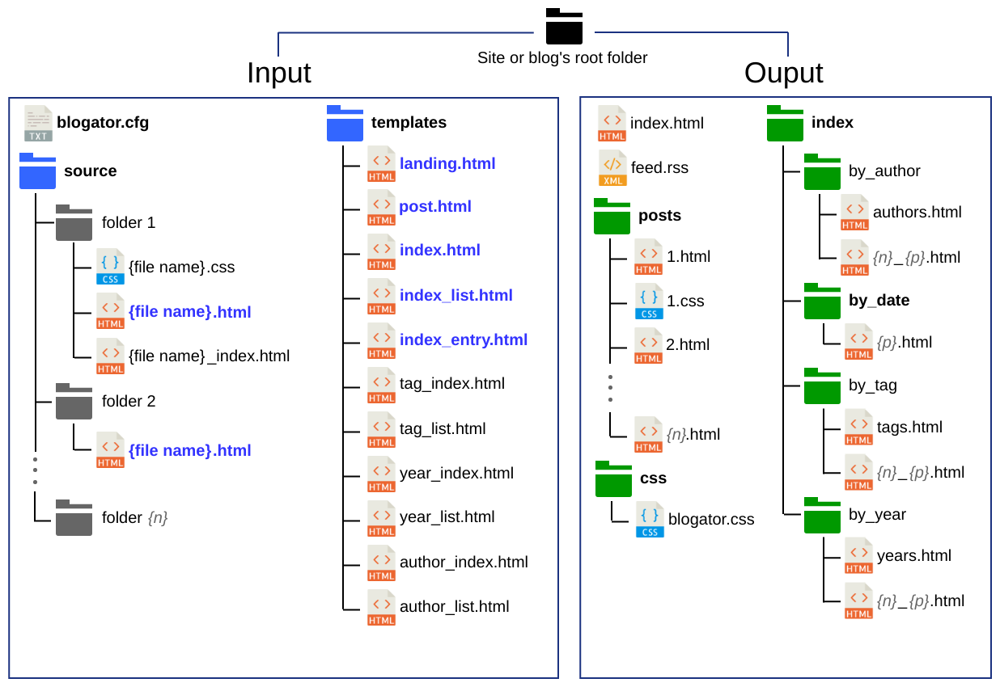

## What is this?

It's a static blog/news template-driven site generator sans-javascript requirements and 
with minimal software library dependencies (written in C++ &#128150;).

It will produce a blog/news site whose navigation works just fine with js disabled at the 
cost of a bit of duplication in the HTML (that amount can range from minimal 
to hog-wild based on your requirements/options set). 

#### Who is it for?

If you:

* still enjoys crafting their website by hand-coding it old-school but just wish you
  could have a blog in there too

* are targeting a reader-base that runs a script blocker by default on their browser 
  (i.e.: security conscious types and anyone that can't stand ads and scroll wheel hijacking),
  
* are someone that just wants to keep things simple on your site

then keep reading.

#### Features:

* HTML5/CSS __only__ so works with JS disabled (e.g. with [NoScript](https://noscript.net/)),
* Template driven (offers some flexibility in design)
* Index generated by date and, optionally tags and/or authors,
* Master indices broken up into pages,
* Custom number of posts per page in the indices,
* Per-page navigation,
* Breadcrumbs (&#127838; nom nom nom),
* Optional post-specific custom stylesheets,
* Custom month strings for dates (to "localise" month names on the index),

#### Fair Warning

There is an expectation of a reasonable level of HTML/CSS proficiency from the operator as 
well as some debugging skills. The software will not sanitise/check your HTML/CSS. That's on you.

## Example

//TODO

## Installing

#### On Arch
//TODO

#### Other
//TODO

## CLI arguments

Run with: `blogator [options] <working directory path>`

| Flag(s)                | Description |
| ---------------------- | ----------- |
|`-c`, `--create-config` | Creates a default configuration file in the working directory and then stops |
|`-h`, `--help`          | Shows help and stops |
|`-d`, `--debug`         | Turns on the debug messages and continues |

| Argument(s) | Description       |
| ----------- | ----------------- |
| {path}      | Working directory |

**Example**

      blogator -c           //Creates a sample configuration file in the current directory
      blogator -c ~/mysite  //Creates a sample configuration file in `~/mysite`  
      blogator              //Runs Blogator to generate site in current directory
      blogator -d ~/mysite  //Runs Blogator to generate site in `~/mysite` with debug messages enabled

## Input/Output overview

Here's a quick bird's eye view of what Blogator takes in and what it outputs and where.
Everything in **bold** in the Input section is a hard requirement.

### Posts/Articles

All posts/articles must be placed in the source folder. The folder hierachy can be whatever you 
want. The only hard restrictions are as follow:

* A custom CSS stylesheet for a particular post must be named the same as its post and be in the 
  same folder.  
  i.e.: `{source/{filename}.html` and `source/{filename}.css`.  
  The stylesheet will be copied and named based on the generated post's file name and a link will 
  be inserted into the `<head></head>` section of the generated post.
* A custom index-entry template (the file used as the index entry for the associated post) must be 
  named the same as its associated post's file name + `_index` and be in the same folder.  
  i.e.: `{source/{filename}.html` and `source/{filename}_index.html`.

**Example:**

    source/
    ├── post1/
    │   ├── post.html           //<time datetime="2019-01-15">
    │   ├── post.css
    │   └── post_index.html
    ├── post2/
    │   ├── awesome.html        //<time datetime="2019-03-15">
    │   └── awesome_index.html
    ├── post3/
    │   ├── radical.html        //<time datetime="2019-02-15">
    │   └── radical.css
          
The software recursively looks into the source folder for any `.html`/`.htm` files and their matching
index entry and stylesheets if any. The posts, after processing, are named by their chronological 
index number. So in the above example it will result with the following inside the post output folder:

    posts/
    ├── 1.html                  //i.e.: post1/post.html (15 January 2019)
    ├── 1.css
    ├── 2.html                  //i.e.: post3/radical.html (15 February 2019)
    ├── 2.css
    └── 3.html                  //i.e.: post2/awesome.html (15 March 2019)
    
    
### CSS Stylesheets

Globally, there are no hard requirements on stylesheets. The software will generate 2 blank files: 
`css/blog.css` and `css/index.css` if one or both do not exist for convenience. It is not necessary
to use either. CSS stylesheets can be declared for each templates like in any run-of-the-mill HTML
file with the usual `<link rel="stylesheet" type="text/css" href="{your CSS file path}"/>`.

### Important file paths

To use when hyperlinks to the different files need to be added in user created html in the site.

| Description               | File Path                         | Notes                                                                     |
| ------------------------- | --------------------------------- | ------------------------------------------------------------------------- |
| Landing page              | `/index.html`                     |                                                                           |
| Index by date             | `/index/by_date/0.html`           | first page of the reverse chronological index of all posts                |
| Index by year             | `/index/by_year/years.html`       | generated if `index-by-year = true;` is set in the configuration file     |
| Index by tags             | `/index/by_tag/tags.html`         | generated if `index-by-tag = true;` is set in the configuration file      |
| Index by authors          | `/index/by_author/authors.html`   | generated if `index-by-author = true;` is set in the configuration file   |
| Blog-wide stylesheet      | `/css/blog.css`                   |                                                                           |
| Index-specific stylesheet | `/css/index.css`                  |                                                                           |

**A note on the indices:** Index files for categorised indices (year/tag/author) are names based
on their category's ID and the page number.

e.g.: Let's say a year is given an ID of `3`, there are 30 articles for that year and, 
in the options, the number of entries per page is set to 10. The end result would be:

    by_year/
    ├── ...
    ├── 3_0.html
    ├── 3_1.html
    ├── 3_2.html
    └── ...
    
In the case of the chronological index (`by_date`), the files are named by their page number 
starting from `0`.
  
## Templates

| File Name               | Description                                     | Target directory path(s)                              |
| ----------------------- | ----------------------------------------------- | ----------------------------------------------------- |
| `landing.html`          | Landing/start page of the site/blog             | `/`                                                   |
| `landing_entry.html`    | Landing page's entry for a post/article         | `/`                                                   |
| `post.html`             | Blog post/Article                               | `/posts`                                              |
| `index.html`            | Index page used for all indices except lists    | `/index/by_date`, `/index/by_tag`, `/index/by_author` |
| `index_list.html`       | Index list page used for all index lists        | `/index/by_date`, `/index/by_tag`, `/index/by_author` |
| `year_list.html`[^1]    | (Override) index list for post years            | `/index/by_year`                                      |
| `year_index.html`[^1]   | (Override) index pages for post years           | `/index/by_year`                                      |
| `tag_list.html`[^1]     | (Override) index list for post categories/tags  | `/index/by_tag`                                       |
| `tag_index.html`[^1]    | (Override) index pages for post categories/tags | `/index/by_tag`                                       |
| `author_list.html`[^1]  | (Override) index list for post authors          | `/index/by_author`                                    |
| `author_index.html`[^1] | (Override) index pages for post authors         | `/index/by_author`                                    |
| `index_entry.html`      | Index page's entry for a post/article           | `/index/by_date`, `/index/by_tag`, `/index/by_author` |

[^1]: Optional 

## Template tag classes

#### Landing page

* `breadcrumb`

> Provides a visual cue as to where in the blog hierarchy the user is currently.

* `newest-posts`

> Most recent posts (entry count can be set in the configuration file's `landing-most-recent`) 

* `top-tags`

> Most used categories/tags (list item count can be set in the configuration file's `landing-top-tags`)

* `top-authors`

> Most prolific authors  (list item count can be set in the configuration file's `landing-top_authors`)

* `featured-posts`

> List of feature posts (source HTML files can be set in the configuration file's `landing-featured`)

#### Landing page entry

* `post-number`

> Number of the article when arranged by date (`1..n` where `n` is the newest).

* `heading`

> Title of the article.

* `authors`

> Authors (each author will be inserted in its own generated `` html tag)

* `tags`

> Tags/Categories (each tag will be inserted in its own generated `` html tag)

* `date-stamp`

> Date for the post.

* `summary`

> Summary text from the post

#### Post/Article page

##### Input tags

* ``

> Title of the post. Anything between the first occurrence of these tags will be used at the title.

* `<time datetime="yyyy-mm-dd"></time>`

> Date stamp. The `yyyy-mm-dd` formatted date-time will be used as the date of the post. Visually, 
  on the user side, that date can be expressed between the tags.   
  e.g.: `<time datetime="2019-06-05">5 June 2019</time>`

* ``

> (Optional) If a tag index is required (see config file), then tag(s) must be given to each posts.
  You can add as many per posts as required. So, for example, if the post is about a river in Italy
  then you can have the following tags:  
  `Rivers`  
  `Italy`

* ``

> (Optional) If an author index is required (see config file), then author(s) must be given to each
  posts. Multiple authors per post is supported. Each author must be placed inside a tag.  
  e.g.: `John Doe`

* ``

> (Optional) Anything inside these tags will be used as a summary in the index entry for the post.
  If the index entry text needs to be slightly different than the content text then one approach 
  could be to put your entry text inside of a summary span and use CSS to hide it in posts.

##### Sample source post example:

    

        <h1>Lorem Ipsum Title</h1>
        <time datetime="2019-06-05">5 Juin 2019</time>
        Sample text 
        Ipsum                      
        L. Ipsum 
        J. Smith
    

    

        

             Lorem ipsum dolor sit amet consectetur 
            adipiscing elit, non purus a etiam quam integer, maecenas 
            habitasse neque quisque iaculis sollicitudin. 
            Luctus aliquam in maecenas quis cubilia urna vulputate 
            fusce eros, nam mauris proin torquent pulvinar fringilla 
            ultrices.
        

        

            Condimentum viverra duis donec consectetur et morbi ac 
            purus libero parturient turpis quisque torquent euismod 
            amet, cubilia aenean sociosqu pharetra facilisis metus 
            habitasse ante dictum sed magna vel convallis fermentum.
        

    

##### Output template

* `breadcrumb`

> Provides a visual cue as to where in the blog hierarchy the user is currently.

* `page-nav`
* `post-content`
* `index-pane-dates`
* `index-pane-tags`

#### Index page (Chronological/Years/Tags/Authors)

* `page-name`

> Name of the page as specified in the configuration file's breadcrumb strings

* `breadcrumb`

> Provides a visual cue as to where in the blog hierarchy the user is currently.

* `page-nav`
* `index-entries`

#### Index List page (Years/Tags/Authors)

* `page-name`

> Name of the page as specified in the configuration file's breadcrumb strings

* `breadcrumb`

> Provides a visual cue as to where in the blog hierarchy the user is currently.

* `index-list`

> Plain and flat `<ul></ul>` list of categories arranged in numerical/alphabetical order.

* `index-list-hierarchy`

> Hierarchy list `<ul></ul>` of categories arranged grouped numerically/alphabetically

#### Index entry

* `post-number`

> Number of the article when arranged by date (`1..n` where `n` is the newest).

* `heading`

> Title of the article.

* `authors`

> Authors (each author will be inserted in its own generated `` html tag)

* `tags`

> Tags/Categories (each tag will be inserted in its own generated `` html tag)

* `date-stamp`

> Date for the post

* `summary` 

> Summary text from the post.

## Configuration file

**File:** `blogator.cfg`

A default config file can be generated from the command line with `./blogator -c` in 
the root of the target site's root folder (see CLI Arguments).

> **Note:** all options keep to 1 line each and are terminated with a semi-colon `;`. 

#### General settings

    site-url = "http://www.domain.com";
    
> The root URL for the site Blogator is generating for.

#### Templates

    template-change-paths = false;
    
> Switch to `true` if you are using working relative paths in the templates for development/preview 
  purposes. This will modify them based on the target html file location it is used to generate.
  Absolute paths (inc those that start with a `/`) will not be touched.

#### Month strings
    
    months = ["January", "February", "Mars", "April", "May", "June", "July", "August", "September", "October", "November", "December"];

> Used on the tree indices on the post pages and indices. If it's not given or the array is not
  complete (12 strings for the 12 months), blogator will default to english names.

#### Posts
    
    build-future = false;
    
> Flag to enable inclusion of future dated posts in the build. Future means any time stamp whose day/month/year
is after the day of the build (i.e. when generator is run).

    safe-purge = true;
    
> Flag enabling deletion in the output post folder (`/posts`) of just html and css files 
  (`*.htm`, `*.html` and `.css`) only whilst leaving any other file types and folders in 
  the structure intact.   
  Good when resources are placed in there for whatever reasons and you don't want them to get 
  nuked during the built process.

    posts-change-paths = false;
    
> Switch to `true` if you are using working relative paths in the posts (`source/` folder) for 
  development/preview purposes. This will modify them based on the target html file location it 
  is used to generate. Absolute paths (inc those that start with a `/`) will not be touched.
    
#### Index

    show-post-numbers = true;
    
> Flag to enable the insertion of the post's publication number in the index entries.
    
    show-summary = false;
    
> Enables/Disables showing summary snippets in the index entries for posts.

    post-summary-pads = ["
", "
"];
    
> Pads any captured spans for the summary text with the given text when writing an
  index entry.   
  e.g.: if the summary text is _"Lorem ipsum dolor sit adipiscing."_ then , 
  with the given padding above, the ouput would be `
Lorem ipsum dolor sit adipiscing.
` 
      
    items-per-page = 10;
    
> Sets the Number of post entries per page in the index

    index-by-year = true;

> Flag to enable the creation of an extra index that groups posts by year

    index-by-tag = true;
    
> Flag to enable the creation of an extra index that groups posts by tags/categories
 
    index-by-author = true;
    
> Flag to enable the creation of an extra index that groups posts by authors

#### Page navigation
    
    page-nav-separator = " / ";
    page-nav-forward   = ">>";
    page-nav-backwards = "<<";
    page-nav-first     = "First";
    page-nav-last      = "Last";
    
> Used for the per-page navigation on the generated html. These strings will be copied **verbatim**
  into their respective `` so custom html tags can be written inside these string values 
  for more flexibility. e.g.:  `page-nav-forward = "

";`
  
###### Note:

If a path is given in a nesting tag for one of the page navigation strings it must be an 
__absolute__ path for it to work across all generated pages.

#### Breadcrumb

    breadcrumb-landing-page   = "Welcome page";
    breadcrumb-by-date-page   = "Index";
    breadcrumb-by-year-page   = "Years";
    breadcrumb-by-tag-page    = "Categories";
    breadcrumb-by-author-page = "Authors";
    breadcrumb-index-page     = "Page ";
           
> Used for the breadcrumb navigation on the generated html. These strings will be copied verbatim
  into their respective ``.
  
###### Note:

Custom html tags can be written inside these string values if you want to get creative. 
For example: `breadcrumb-landing-page = "";`.
Though, if a path is given in a nesting tag for one or more of breadcrumb strings it must be an 
__absolute__ path for it to work across all generated pages.
  
#### Landing page

    landing-most-recent = 5;
    
> Number of entries to the most recent posts/articles to place inside the `newest-posts` section 
  of the page. 

    landing-top-tags    = 5;
    landing-top_authors = 5;
    
> Top used tags/authors in the posts/articles to display inside the `top-tags` and `top-authors` 
sections respectively of the page. 
      
    landing-featured = ["0.html", "1.html", "2.html"];
    
> List of filenames of source posts to display inside the `featured-posts` section of the page. 

#### RSS feed
    
    rss             = true;
    rss-item-count  = 5;
    rss-title       = "My site";
    rss-description = "An awesome retro-futuristic site";
    rss-copyright   = "V 2077";
    rss-img-url     = "img/logo.svg";
    rss-img-link    = "http://www.domain.com/";
    rss-img-width   = "50px";
    rss-img-height  = "50px";
    rss-img-alt     = "Site logo";
   
## Support

#### Assumptions made

* All tags are closed properly (check you source HTML if the generated output is incorrect).
* hyperlinks tags are opened/closed on the same line
* hyperlinks start with `<a` and finish with `</a>`
* heading/date/tag/author in source posts are individually opened/closed on the same line

#### Troubleshooting

* See above first!
* Turn on the debug messages from the command line (`--debug`) to get a bit more information.

#### Language/Character sets

As my original use-case for this software dealt with a site written in english, the 
implementation uses standard strings (`std::string`) and not wide character strings 
(`std::wstring`).

Officially only english is supported for the moment but your mileage in different 
languages/character sets may vary. I had no problem generating for a french language 
based site with all the wonderful `é` `ê` `è` `ç` types of characters that come with it. :)

**TL/DR: `UTF-8` should not pose a problem but `UTF-16` will.** 

`UTF-16` is something that might be supported in version `2.0` if it gets to that. I do not 
plan to deal with this for any `1.x` versions.

#### Platform/Requirements

Officially, Linux and a compiler that supports C++17.

Note that I make heavy use of `std::filesystem` and some libraries 
might not have a complete implementation of that yet (`GCC 1.9.0` on 
Arch linux works fine for reference).

## Contributing

I'm open to:

* bug reports including a copy of your terminal output with the `--debug` flag enabled 
  (source html files that can reproduce the issue would be appreciated when relevant), 
* suggestions for improvements (docs and features).

## License

Software is provided as-is (i.e.: {*insert std. disclaimer here*}, backup you sh*t __before__ 
running the software, etc...).

Blogator is licensed under [GNU AGPLv3](LICENSE.txt)

The example templates (except anything in `img/*.*`) is licensed for **personal use only**. 
You can also base your own template from it if you like as long as you don´t make money off it.

The image of the cat (`img/me.png`) included in the template is under copyright @An7ar35 2017.