# BLOGATOR

## What is this?

It's a static blog/news template-driven site generator sans-javascript requirements and 
with minimal software library dependencies (written in C++).

It will produce a blog/news site whose navigation works just fine with js disabled at the 
cost of a bit of duplication in the HTML (that amount can range from minimal 
to hog-wild based on your requirements/options set).

#### Who is it for?

If you:

* still enjoys crafting their website by hand-coding it old-school but just wish you
  could have an easier way to publish blog posts statically.

* are targeting a reader-base that runs a script blocker by default on their browser.
  
* are someone that just cannot stand javascript anymore in you life.

then keep reading.

#### Features:

* HTML5/CSS __only__ so works with JS disabled (e.g. with [NoScript](https://noscript.net/)),
* Template driven (offers some flexibility in design)
* Index generated by date and, optionally tags and/or authors,
* Master indices broken up into pages,
* Custom number of posts per page in the indices,
* Per-page navigation,
* Breadcrumbs!,
* Optional post-specific custom stylesheets,
* Custom month strings for dates (to "localise" month names on the index),

#### Fair Warning

I've written this software basically for myself to help me automate things a little whilst 
still keeping control. In short, I've built it with the assumption that the user can code 
HTML/CSS completely by hand and is proficient in debugging their own HTML at the absolute 
least.

__Blogator will not hold your hand.__

## Folder structure

### Important file paths

To use when hyperlinks to the different files need to be added in user created html in the site.

| Description               | Path                              | Notes                                                                     |
| ------------------------- | --------------------------------- | ------------------------------------------------------------------------- |
| Landing page              | `/index.html`                     |                                                                           |
| Index by date             | `/index/by_date/0.html`           | first page of the chronological index of all posts                        |
| Index by tags             | `/index/by_tags/tags.html`        | generated if `index-by-tag = true;` is set in the configuration file      |
| Index by authors          | `/index/by_author/authors.html`   | generated if `index-by-author = true;` is set in the configuration file   |
| Blog-wide stylesheet      | `/css/blog.css`                   |                                                                           |
| Index-specific stylesheet | `/css/index.css`                  |                                                                           |

## Templates

| File Name             | Description                                   |
|-----------------------| --------------------------------------------- |
| `landing.html`        | Landing/start page of the site/blog           |
| `landing_entry.html`  | Landing page's entry for a post/article       |
| `post.html`           | Blog post/Article                             |
| `index.html`          | Index page used for all indices except lists  |
| `tag_list.html`       | Index list of post categories/tags            |
| `author_list.html`    | Index list of post authors                    |
| `index_entry.html`    | Index page's entry for a post/article         |

## Template tags

#### Landing page

* `breadcrumb`: self explanatory really. Provides a visual cue as to where in the blog hierarchy the user is currently
* `newest-posts`: Most recent posts (entry count can be set in the configuration file) 
* `top-tags`: Most used categories/tags (entry count can be set in the configuration file)
* `top-authors` //NOT IMPLEMENTED
* `featured-posts`: List of feature posts (source HTML file can be set in the configuration file)

#### Landing page entry

* `post-number`: Number of the article when arranged by date (`1..n` where `n` is the newest)
* `heading`: Title of the article
* `authors`: Authors (each author will be inserted in its own generated `` html tag)
* `tags`: Tags/Categories (each tag will be inserted in its own generated `` html tag)
* `date-stamp`: Date for the post
* `summary` //NOT IMPLEMENTED

#### Post/Article page

* `breadcrumb`
* `page-nav`
* `post-content`
* `index-pane-dates`
* `index-pane-tags`

#### Index page

* `breadcrumb`
* `page-nav`
* `index-entries`

#### Tag/Category list page

* `breadcrumb`
* `tag-list`
* `tag-list-hierarchy`

#### Author list page

* `breadcrumb`
* `author-list`
* `author-list-hierarchy` //NOT IMPLEMENTED

#### Index entry

* `post-number`
* `heading`
* `authors`
* `tags`
* `date-stamp`
* `summary` //NOT IMPLEMENTED

## Configuration file

**File:** `blogator.cfg`

A default config file can be generated from the command line with `./blogator -c` in 
the root of the target site's root folder. //NOT YET IMPLEMENTED

> **Note:** all options keep to 1 line each and are terminated with a semi-colon `;`. 

#### General settings

    //General settings
    site-url       = "http://www.domain.com";
    canonify-urls  = false; //TODO 0: relative paths, 1: absolute paths with the site's URL as root, 
    log-file       = "";    //TODO Save path of the log file. If empty then no log file will be created

#### Month strings
    
    months = ["January", "February", "Mars", "April", "May", "June", "July", "August", "September", "October", "November", "December"];

> Used on the tree indices on the post pages and indices. If it's not given or the array is not
  complete (12 months -> 12 strings), blogator will default to english names

#### Posts
    
    build-future = false;
    
> Flag to enable inclusion of future dated posts in the build. Future means any time stamp whose day/month/year
is after the day of the build (i.e. when generator is run).

    safe-purge = true;  //TODO
    
> Flag enabling deletion in the output post folder (`/posts`) of just html files only whilst 
  leaving any other file types and folders in the structure intact. Good when resources are 
  placed in there for x reasons by the user.
    
#### Index

    show-post-numbers = true;  //flag for displaying post numbers in the index
    items-per-page    = 10;    //Number of posts per page in the index
    index-by-tag      = true;  //flag to create an extra index that groups posts by tags/categories 
    index-by-author   = false; //flag to create an extra index that groups posts by authors
    summary-length    = 200;   //TODO Number of characters for the summaries (taken from the first 

 inside the source posts

#### Page navigation
    
    page-nav-separator = " / ";
    page-nav-forward   = ">>";
    page-nav-backwards = "<<";
    page-nav-first     = "First";
    page-nav-last      = "Last";
    
> Used for the per-page navigation on the generated html. These strings will be copied verbatim
  into their respective `` so custom html tags can be written inside these string values 
  for more flexibility. e.g.:  `page-nav-forward = "

";`
  
###### Note:

If a path is given in a nesting tag for one of the page navigation strings it must be an 
__absolute__ path for it to work across all generated pages.

#### Breadcrumb

    breadcrumb-landing-page   = "Welcome page";
    breadcrumb-by-tag-page    = "Categories";
    breadcrumb-by-author-page = "Authors";
    breadcrumb-by-date-page   = "Index";
    breadcrumb-index-page     = "Page ";
    
> Used for the breadcrumb navigation on the generated html. These strings will be copied verbatim
  into their respective `` so custom html tags can be written inside these string values 
  for more flexibility. e.g.:  `breadcrumb-landing-page = "";`
  
###### Note:

If a path is given in a nesting tag for one or more of breadcrumb strings it must be an 
__absolute__ path for it to work across all generated pages.
  
#### Landing page

    landing-most-recent = 5;
    
> Number of entries to the most recent posts/articles to place inside the `newest-posts` section 
  of the page. 

    landing-top-tags = 5;
    
> Top used tags in the posts/articles to display inside the `top-tags` section of the page. 
      
    landing-featured = ["0.html", "1.html", "2.html"];
    
> List of filenames of source posts to display inside the `featured-posts` section of the page. 

#### RSS feed
    
    rss             = true;
    rss-item-count  = 5;
    rss-title       = "My site";
    rss-description = "An awesome retro-futuristic site";
    rss-copyright   = "V 2077";
    rss-img-url     = "img/logo.svg";
    rss-img-link    = "http://www.domain.com/";
    rss-img-width   = "50px";
    rss-img-height  = "50px";
    rss-img-alt     = "Site logo";
   

## Support

#### Language/Character sets

As my original use-case for this software dealt with a site written in english, the 
implementation uses standard strings (`std::string`) and not wide character strings 
(`std::wstring`).

Officially only english is supported for the moment but your mileage in different 
languages/character sets may vary. I had no problem generating for a french language 
based site with all the wonderful `é` `ê` `è` `ç` types of characters that come with it. :)

I welcome any feedback in that regard. 

#### Platform

Linux and a compiler that supports C++20. 

> As the software doesnt't use any exotic libraries aside from C++'s STL it should be compilable 
  on other platforms (Windows/Mac) as long as you have that C++20 complient compiler on the 
  machine. 

## Contributing

If/when I've got the time I'll update as I run into different use-cases / come 
up with ideas on how to improve this and make it more flexible. 

I'm open to:

* bug reports (source html files that can reproduce the issue would be appreciated when relevant), 
* suggestions for improvements.

## Contact

You can email me. Please make sure to add `Blogator: ` + what it's about in the subject line. 
This way it's much less likely to be sent in the spam/trash by my filters. 

My email can be found on my site.

## License

Software is provided as-is. I.e.: {insert std disclaimer here}, backup you sh*t __before__ running the software, etc...
