# BLOGATOR

Static blog/news site generator sans-javascript.

For those who prefer to hand-craft their site, think of JS as an extra rather 
than a necessity but still would like to keep a blog without the headache of 
indexing everything by hand.

#### Features:
* HTML5/CSS __only__ so works with JS disabled (e.g. with [NoScript](https://noscript.net/)),
* Index generated by date and tags,
* Master indices broken up into pages,
* Custom number of posts per page in the indices,
* Per-page navigation,
* Optional post-specific custom stylesheets,
* Common Header/Footer for all posts,
* Custom month strings for dates (from a K,V pair file so can localise month names on the index),
* Relative paths used throughout.

